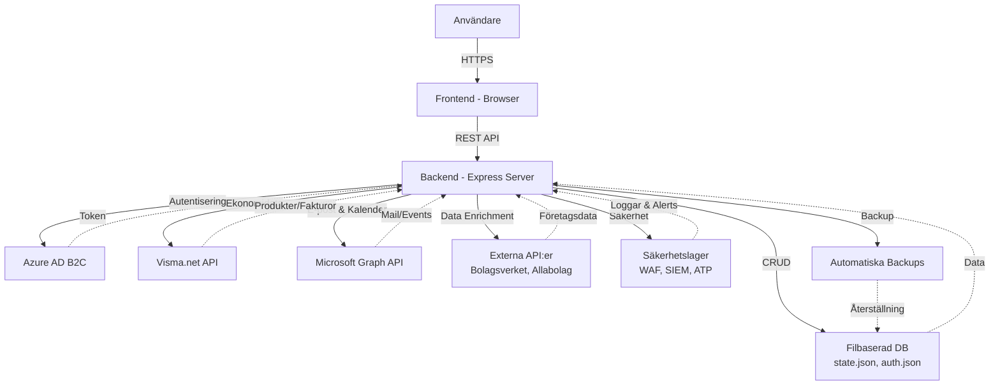

# Teknisk Beskrivning – CRM-system

## 1. Systemöversikt

CRM-systemet är en modern, modulär och säker plattform för kund- och affärsdata, byggd med Node.js och Express på backend samt en JavaScript-baserad frontend. Systemet är designat för skalbarhet, integrationer och hög säkerhet, med stöd för molndatabaser och externa API:er.

**Version:** 1.1.4  
**Node.js:** v22+  
**Produktionsstatus:** Produktionsklar med säkerhetsfunktioner

---

## 2. Arkitektur

### 2.1 Frontend
- **Teknik:** HTML5, CSS3, JavaScript (ES6+)
- **UI:** Responsiv design, komponentbaserad struktur
- **Kommunikation:** RESTful API-anrop mot backend
- **Funktioner:** 
  - Kundhantering (brands, companies, agents)
  - Säljpipeline (Kanban-board med drag-and-drop)
  - Rapporter och dashboard
  - Säkerhetsdashboard (WAF, SIEM, ATP)
  - Outlook-integration
  - Två-faktor autentisering (2FA)

### 2.2 Backend
- **Teknik:** Node.js v22, Express v4
- **API:** RESTful endpoints för CRUD, autentisering, integrationer
- **Middleware:** 
  - Helmet (HTTP security headers)
  - express-rate-limit (rate limiting)
  - express-slow-down (slowdown attacks)
  - CORS (cross-origin resource sharing)
  - compression (gzip)
- **Säkerhet:** 
  - bcrypt för lösenordshashing
  - PBKDF2 för shared password
  - Session management med timeouts
  - Audit logging (audit.log)
  - Security logging (security.log)
  - GDPR-stöd
  - Web Application Firewall (WAF)
  - SIEM (Security Information and Event Management)
  - ATP (Advanced Threat Protection)
  - Zero Trust Manager
  - SSL Security Manager
- **Konfiguration:** Miljövariabler via `.env` för produktionsdrift
- **Datalagring:** 
  - Filbaserad (JSON): state.json, auth.json
  - Automatiska backups var 4h (dev) / 24h (prod)
  - Backup-rotation och compression

### 2.3 Databas
- **Aktuell implementation:** Filbaserad JSON-lagring
- **Alternativ (konfigurerbara):** 
  - Azure Cosmos DB
  - Azure SQL Database
  - Azure Blob Storage
- **Data:** Kunddata, användare, loggar, rapporter
- **Åtkomst:** Synkron filbaserad I/O med atomiska skrivningar

### 2.4 Integrationer
- **Azure AD B2C:** Single Sign-On, användarhantering, dual user management
- **Visma.net:** Ekonomidata, produktsynkronisering, fakturahantering
- **Microsoft Graph:** Outlook-integration (mail, calendar, contacts)
- **Externa API:er:** Bolagsverket, Allabolag, Google Places (data enrichment)

---

## 3. Dataflöden

### 3.1 Övergripande arkitektur



### 3.2 Autentiseringsflöde

1. **Användare** loggar in via frontend
2. **Frontend** skickar credentials till `/api/login`
3. **Backend** validerar mot Azure AD B2C eller lokal auth.json
4. Vid 2FA: Backend genererar och skickar QR-kod/kod
5. Användare verifierar 2FA
6. **Backend** skapar session och returnerar session-cookie
7. **Frontend** lagrar session och visar dashboard

### 3.3 CRUD-flöde (Exempel: Skapa företag)

1. **Frontend** skickar POST `/api/state` med uppdaterad state
2. **Backend** validerar session och behörighet
3. Backend uppdaterar `state.json` atomiskt
4. Backend loggar händelse i `audit.log`
5. Backend returnerar success
6. **Frontend** uppdaterar UI

### 3.4 Integrationsflöde (Exempel: Visma.net synk)

1. **Användare** initierar synk från UI
2. **Frontend** anropar `/api/visma/sync`
3. **Backend** autentiserar mot Visma.net OAuth
4. Backend hämtar produkter/kunder från Visma.net
5. Backend mappar och uppdaterar lokal databas
6. Backend returnerar synkrapport
7. **Frontend** visar resultat

---

## 4. Säkerhet och Compliance

### 4.1 Autentisering & Auktorisering
- **OAuth2 via Azure AD B2C** (primär metod)
- **Lokal autentisering** med bcrypt-hashade lösenord
- **2FA (Two-Factor Authentication)** med TOTP (Time-based One-Time Password)
- **Session management:** Secure cookies, HTTP-only, SameSite=strict
- **Session timeout:** 30 minuter inaktivitet
- **Concurrent session limit:** Max 3 sessions per användare

### 4.2 Säkerhetslager
- **WAF (Web Application Firewall):**
  - SQL injection-skydd
  - XSS-skydd
  - CSRF-skydd
  - Rate limiting per IP
  - Threat intelligence (kända IP-hot)
  
- **SIEM (Security Information and Event Management):**
  - 6 korrelationsregler
  - Realtidsövervakning av säkerhetshändelser
  - Loggar kritiska händelser
  
- **ATP (Advanced Threat Protection):**
  - AI-baserad anomali-detektion
  - Beteendeanalys
  - Automatisk blockering av misstänkta IP:er
  
- **Zero Trust Manager:**
  - Verifiering vid varje request
  - Least privilege access
  
- **SSL Security Manager:**
  - Certifikatövervakning
  - Automatiska varningar vid utgående certifikat

### 4.3 Rate Limiting
- **Login:** 5 försök per 15 minuter
- **API:** 1000 requests per 15 minuter
- **Download:** 10 nedladdningar per timme
- **Upload:** 20 uppladdningar per timme

### 4.4 Input Validation
- **Max string length:** 1000 tecken
- **Max JSON size:** 10MB
- **Max file size:** 50MB
- **Allowed file types:** .xlsx, .xls, .csv
- **HTML sanitization:** DOMPurify

### 4.5 Audit Logging
- Alla kritiska händelser loggas i `audit.log`
- Loggade händelser: login, logout, CRUD, import/export, config changes
- Logformat: JSON med timestamp, user, action, IP

### 4.6 GDPR-stöd
- Dataskyddsfunktioner för användare
- Export av persondata
- Radering av persondata
- Logging av dataskyddsåtgärder

---

## 5. API-specifikation

### 5.1 Autentisering

| Endpoint | Method | Beskrivning |
|----------|--------|-------------|
| `/api/login` | POST | Logga in användare |
| `/api/logout` | POST | Logga ut användare |
| `/api/session/check` | GET | Kontrollera session-status |
| `/api/2fa/setup` | POST | Aktivera 2FA |
| `/api/2fa/verify` | POST | Verifiera 2FA-kod |

### 5.2 CRUD (State management)

| Endpoint | Method | Beskrivning |
|----------|--------|-------------|
| `/api/state` | GET | Hämta fullständig state |
| `/api/state` | POST | Uppdatera state |

### 5.3 Import/Export

| Endpoint | Method | Beskrivning |
|----------|--------|-------------|
| `/api/import/excel` | POST | Importera Excel-fil |
| `/api/import/ortspris` | GET/POST | Importera Ortspris-data |
| `/api/import/maklarpaket` | POST | Importera mäklarpaket |
| `/api/export/csv` | GET | Exportera till CSV |

### 5.4 Admin

| Endpoint | Method | Beskrivning |
|----------|--------|-------------|
| `/api/admin/clear` | POST | Rensa all CRM-data |
| `/api/admin/logs` | GET | Hämta audit logs |
| `/api/admin/brands/backfill` | POST | Backfill brands |

### 5.5 Integrationer

**Visma.net:**
- `/api/visma/auth` - Autentisera
- `/api/visma/customers` - Hämta kunder
- `/api/visma/products` - Hämta produkter
- `/api/visma/sync` - Synkronisera data

**Outlook (Microsoft Graph):**
- `/api/outlook/auth` - Autentisera
- `/api/outlook/emails` - Hämta mail
- `/api/outlook/send` - Skicka mail
- `/api/outlook/calendar` - Hantera kalender

### 5.6 Hälsa & Monitoring

| Endpoint | Method | Beskrivning |
|----------|--------|-------------|
| `/health` | GET | Hälsokontroll (status, uptime) |

---

## 6. Datamodell

### 6.1 State (state.json)

```javascript
{
  users: [],           // Användare (för lokal auth)
  currentUserId: null, // Aktuell användare
  brands: [],          // Varumärken/Kedjor
  companies: [],       // Företag/Kontor
  agents: [],          // Mäklare/Användare
  contacts: [],        // Kontakter
  tasks: [],           // Uppgifter
  notes: []            // Anteckningar
}
```

**Brand (Varumärke):**
```javascript
{
  id: "b1",
  namn: "Fantastic Frank",
  centralContract: {
    active: true,
    product: "Premium",
    mrr: 50000
  }
}
```

**Company (Företag):**
```javascript
{
  id: "c1",
  namn: "Fantastic Frank Malmö",
  brandId: "b1",
  segmentId: "real-estate",
  stad: "Malmö",
  status: "kund",           // kund, prospekt, ej
  pipelineStage: "vunnit",  // kvalificerad, offert, förhandling, vunnit, förlorat
  potentialValue: 120000,
  payment: 15000,           // MRR
  product: "Premium",
  customerNumber: "12345678",
  orgNumber: "556123-4567",
  centralContract: true
}
```

**Agent (Mäklare):**
```javascript
{
  id: "a1",
  förnamn: "Anna",
  efternamn: "Andersson",
  email: "anna@ff.se",
  telefon: "070-1234567",
  companyId: "c1",
  status: "kund",
  licens: {
    status: "aktiv",      // aktiv, test, ingen
    typ: "Premium"
  }
}
```

### 6.2 Auth (auth.json)

```javascript
{
  shared: {                 // Delat lösenord (fallback)
    salt: "...",
    hash: "..."
  },
  usersByUsername: {        // Individuella användare
    "admin": {
      id: "u1",
      username: "admin",
      passwordHash: "...",
      role: "admin",
      twoFactorEnabled: true,
      twoFactorSecret: "..."
    }
  },
  usersById: {
    "u1": { ...samma data... }
  }
}
```

---

## 7. Deployment & Drift

### 7.1 Miljöhantering
- **Development:** `NODE_ENV=development`, backup var 4h
- **Production:** `NODE_ENV=production`, backup var 24h
- Konfiguration via `.env` (se `DEPLOYMENT_GUIDE.md`)

### 7.2 Containerstöd
- Docker och docker-compose för enkel deployment
- `Dockerfile` inkluderad för containerisering

### 7.3 CI/CD
- Stöd för automatiserad test och deployment
- GitHub Actions / Azure DevOps

### 7.4 Monitoring
- Application Insights (Azure)
- `/health` endpoint för health checks
- Uptime monitoring (Pingdom, UptimeRobot)

---

## 8. Skalbarhet & Underhåll

### 8.1 Modulär kodbas
- Tydlig separation: auth, integration, data, UI
- Lätt att lägga till nya integrationer
- Middlewares för återanvändbar logik

### 8.2 Extensibilitet
- Pluggbar integration-arkitektur
- Konfigurerbar via miljövariabler
- API-first design

### 8.3 Automatiserade tester
- (Planerat) Enhetstester och integrationstester
- `npm test` kommando förberett

### 8.4 Dokumentation
- Inline-kommentarer i kod
- Markdown-guider för setup och deployment
- API-specifikation (denna dokument)

---

## 9. Rekommenderade Best Practices

### 9.1 Säkerhet
- Använd alltid produktionsmiljö med säkra secrets och API-nycklar
- Aktivera HTTPS och säkra cookies
- Uppdatera och patcha beroenden regelbundet (npm audit)
- Övervaka och logga alla kritiska händelser
- Genomför penetrationstester årligen

### 9.2 Prestanda
- Övervaka serverbelastning (CPU, RAM)
- Använd compression middleware
- Implementera caching vid behov
- Optimera filbaserad databas vid många objekt (>10k)

### 9.3 Backup & Återställning
- Verifiera att automatiska backups fungerar
- Testa återställning regelbundet
- Lagra backups offsite (Azure Blob, S3)

### 9.4 Användare
- Utbilda användare i säkerhet (starka lösenord, 2FA)
- Dokumentera vanliga workflows
- Samla in feedback för kontinuerlig förbättring

---

## 10. Roadmap & Framtida funktioner

- [ ] Migration till relationsdatabas (PostgreSQL/Azure SQL)
- [ ] GraphQL API
- [ ] Mobilapp (React Native)
- [ ] Avancerad rapportering med BI-verktyg
- [ ] AI-baserade insights och rekommendationer
- [ ] Webhook-integrationer
- [ ] Multi-tenant support

---

*Senast uppdaterad: 2025-11-03*  
*Version: 1.1.4*
