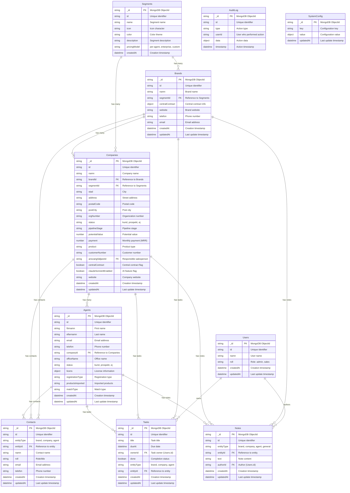

# Database Structure - Azure Cosmos DB (MongoDB API)

This document describes the database structure for the JRM CRM system using Azure Cosmos DB with MongoDB API.

## Mermaid Diagram



## Collection Details

### Core Business Collections

#### Users
- **Purpose**: System users and authentication
- **Key Fields**: `namn` (name), `roll` (role)
- **Indexes**: 
  - `{ id: 1 }` (unique)
  - `{ roll: 1 }`

#### Segments
- **Purpose**: Business segments (real estate, banking, etc.)
- **Key Fields**: `name`, `pricingModel`
- **Indexes**: `{ id: 1 }` (unique)

#### Brands
- **Purpose**: Brand/franchise chains
- **Key Fields**: `namn` (name), `segmentId`, `centralContract`
- **Indexes**: 
  - `{ id: 1 }` (unique)
  - `{ segmentId: 1 }`
  - `{ namn: "text" }` (text search)

#### Companies
- **Purpose**: Individual offices/companies
- **Key Fields**: `namn`, `brandId`, `status`, `payment`
- **Indexes**: 
  - `{ id: 1 }` (unique)
  - `{ brandId: 1 }`
  - `{ segmentId: 1 }`
  - `{ status: 1 }`
  - `{ customerNumber: 1 }`
  - `{ orgNumber: 1 }`
  - `{ namn: "text" }` (text search)

#### Agents
- **Purpose**: Individual agents/brokers
- **Key Fields**: `förnamn`, `efternamn`, `companyId`, `licens`
- **Indexes**: 
  - `{ id: 1 }` (unique)
  - `{ companyId: 1 }`
  - `{ email: 1 }`
  - `{ status: 1 }`
  - `{ "licens.status": 1 }`

### Activity Collections

#### Contacts
- **Purpose**: Decision makers and key contacts
- **Key Fields**: `entityType`, `entityId`, `namn`, `roll`
- **Indexes**: 
  - `{ id: 1 }` (unique)
  - `{ entityType: 1, entityId: 1 }`

#### Tasks
- **Purpose**: To-do items and follow-ups
- **Key Fields**: `title`, `ownerId`, `done`, `dueAt`
- **Indexes**: 
  - `{ id: 1 }` (unique)
  - `{ ownerId: 1 }`
  - `{ done: 1 }`
  - `{ dueAt: 1 }`
  - `{ entityType: 1, entityId: 1 }`

#### Notes
- **Purpose**: Free-text notes and comments
- **Key Fields**: `text`, `authorId`, `entityType`, `entityId`
- **Indexes**: 
  - `{ id: 1 }` (unique)
  - `{ authorId: 1 }`
  - `{ entityType: 1, entityId: 1 }`
  - `{ text: "text" }` (text search)

### System Collections

#### AuditLog
- **Purpose**: System audit trail
- **Key Fields**: `type`, `userId`, `timestamp`
- **Indexes**: 
  - `{ timestamp: -1 }`
  - `{ type: 1 }`
  - `{ userId: 1 }`

#### SystemConfig
- **Purpose**: System configuration and settings
- **Key Fields**: `key`, `value`
- **Indexes**: `{ key: 1 }` (unique)

## Data Relationships

### Hierarchical Structure
```
Segments
└── Brands
    └── Companies
        └── Agents
```

### Polymorphic Associations
- **Contacts**: Can be associated with Brands, Companies, or Agents
- **Tasks**: Can be associated with Brands, Companies, or Agents
- **Notes**: Can be associated with Brands, Companies, Agents, or be general

### Reference Integrity
- `Companies.brandId` → `Brands.id`
- `Agents.companyId` → `Companies.id`
- `Tasks.ownerId` → `Users.id`
- `Notes.authorId` → `Users.id`
- Polymorphic: `entityId` references depend on `entityType`

## Cosmos DB Specific Considerations

### Partition Strategy
- **Recommended Partition Key**: `segmentId` for most collections
- **Alternative**: Use `brandId` for agent-heavy workloads
- **Small Collections**: Use synthetic partition key

### Indexing Strategy
- **Automatic**: All properties auto-indexed by default
- **Custom**: Create composite indexes for common query patterns
- **Text Search**: Enable for `namn`, `text` fields

### Document Size
- **Typical**: 1-10KB per document
- **Maximum**: 2MB per document (Cosmos DB limit)
- **Optimization**: Consider embedding vs. referencing

### Query Patterns
- **Cross-partition**: Minimize with good partition key
- **Point reads**: Use `id` field for single document retrieval
- **Range queries**: Leverage indexed fields like `dueAt`, `status`

## Migration from JSON File
The current system uses a single `state.json` file. Migration to Cosmos DB involves:

1. **Split by Collection**: Separate arrays into individual collections
2. **Add Metadata**: Include `createdAt`, `updatedAt` timestamps
3. **Maintain IDs**: Keep existing `id` fields, let MongoDB generate `_id`
4. **Index Creation**: Set up required indexes
5. **Data Validation**: Ensure referential integrity

## Example Documents

### Brand Document
```json
{
  "_id": "ObjectId(...)",
  "id": "b1",
  "namn": "Fantastic Frank",
  "segmentId": "real-estate",
  "centralContract": {
    "active": true,
    "product": "Premium",
    "mrr": 50000
  },
  "website": "https://fantasticfrank.se",
  "createdAt": "2024-01-15T10:30:00Z",
  "updatedAt": "2024-11-03T14:22:00Z"
}
```

### Company Document
```json
{
  "_id": "ObjectId(...)",
  "id": "c1",
  "namn": "Fantastic Frank Malmö",
  "brandId": "b1",
  "segmentId": "real-estate",
  "stad": "Malmö",
  "status": "kund",
  "payment": 15000,
  "customerNumber": "12345678",
  "createdAt": "2024-01-15T10:35:00Z",
  "updatedAt": "2024-11-03T14:22:00Z"
}
```

### Agent Document
```json
{
  "_id": "ObjectId(...)",
  "id": "a1",
  "förnamn": "Anna",
  "efternamn": "Andersson",
  "email": "anna@ff.se",
  "companyId": "c1",
  "status": "kund",
  "licens": {
    "status": "aktiv",
    "typ": "Premium"
  },
  "createdAt": "2024-01-15T10:40:00Z",
  "updatedAt": "2024-11-03T14:22:00Z"
}
```