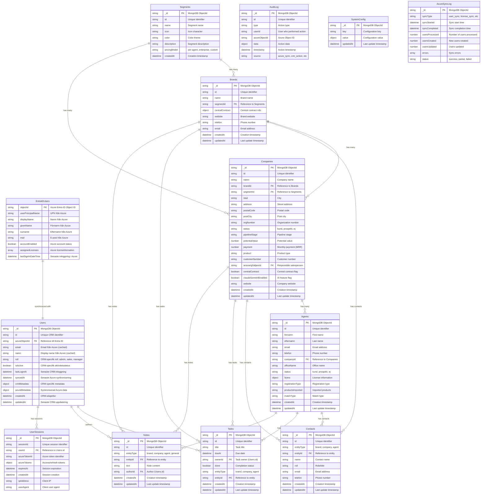

# Database Structure med Entra ID Integration - Azure Cosmos DB (MongoDB API)

Detta dokument beskriver hur databasstrukturen förändras när autentisering kopplas mot Azure Entra ID (tidigare Azure AD B2C).

## Huvudskillnader med Entra ID

### Users-kollektionen: Hybrid Roll

När du använder Entra ID för autentisering blir `Users`-kollektionen en **hybrid** mellan:
1. **Lokal användarhantering** - CRM-specifik metadata och behörigheter
2. **Azure-synkronisering** - Synkroniserad information från Entra ID

## Uppdaterad Mermaid Diagram



## Users-kollektionen: Detaljerad Structure

### Hybrid Ansvar

```typescript
interface User {
  // MongoDB
  _id: string;                    // MongoDB ObjectId
  id: string;                     // CRM unique ID
  
  // Azure Integration
  azureObjectId: string;          // Azure Entra ID Object ID (UNIQUE)
  email: string;                  // Cached från Azure
  namn: string;                   // Cached från Azure (displayName)
  
  // CRM-Specifik Data
  roll: 'admin' | 'manager' | 'sales' | 'viewer';  // CRM behörigheter
  isActive: boolean;              // CRM-specifik aktivitetsstatus
  
  // Metadata
  lastLoginAt: Date;              // Senaste CRM-inloggning
  syncedAt: Date;                 // Senaste Azure-synkronisering
  
  crmMetadata: {
    preferredLanguage?: string;
    defaultView?: string;
    notifications?: boolean;
    customSettings?: object;
  };
  
  azureMetadata: {
    userPrincipalName?: string;
    givenName?: string;
    surname?: string;
    accountEnabled?: boolean;
    lastSignInDateTime?: Date;
    assignedLicenses?: string[];
  };
  
  // Timestamps
  createdAt: Date;
  updatedAt: Date;
}
```

## Autentiseringsflöde

### 1. Första inloggningen
```javascript
// När användare loggar in via Entra ID första gången
async function handleFirstTimeLogin(azureUser) {
  // Kontrollera om användare redan finns i CRM
  let crmUser = await db.users.findOne({ azureObjectId: azureUser.objectId });
  
  if (!crmUser) {
    // Skapa ny CRM-användare
    crmUser = await db.users.insertOne({
      id: generateId(),
      azureObjectId: azureUser.objectId,
      email: azureUser.mail,
      namn: azureUser.displayName,
      roll: 'viewer', // Standard roll
      isActive: true,
      crmMetadata: {},
      azureMetadata: {
        userPrincipalName: azureUser.userPrincipalName,
        givenName: azureUser.givenName,
        surname: azureUser.surname,
        accountEnabled: azureUser.accountEnabled
      },
      syncedAt: new Date(),
      createdAt: new Date(),
      updatedAt: new Date()
    });
  }
  
  // Uppdatera senaste inloggning
  await db.users.updateOne(
    { _id: crmUser._id },
    { 
      $set: { 
        lastLoginAt: new Date(),
        syncedAt: new Date(),
        'azureMetadata.lastSignInDateTime': azureUser.lastSignInDateTime
      }
    }
  );
  
  return crmUser;
}
```

### 2. Återkommande inloggningar
```javascript
async function handleReturningLogin(azureUser) {
  // Hitta befintlig användare
  const crmUser = await db.users.findOne({ azureObjectId: azureUser.objectId });
  
  if (!crmUser) {
    throw new Error('CRM user not found for Azure user');
  }
  
  // Synkronisera uppdaterad Azure-data
  await db.users.updateOne(
    { _id: crmUser._id },
    {
      $set: {
        email: azureUser.mail,
        namn: azureUser.displayName,
        lastLoginAt: new Date(),
        syncedAt: new Date(),
        azureMetadata: {
          ...crmUser.azureMetadata,
          userPrincipalName: azureUser.userPrincipalName,
          givenName: azureUser.givenName,
          surname: azureUser.surname,
          accountEnabled: azureUser.accountEnabled,
          lastSignInDateTime: azureUser.lastSignInDateTime
        },
        updatedAt: new Date()
      }
    }
  );
  
  return crmUser;
}
```

## Azure Synkroniseringsstrategier

### 1. Real-time Sync (Webhook)
```javascript
// Azure Entra ID webhook endpoint
app.post('/api/webhooks/entra-id/user-updated', async (req, res) => {
  const { objectId, eventType, userData } = req.body;
  
  if (eventType === 'user.updated' || eventType === 'user.disabled') {
    await syncSingleUserFromAzure(objectId, userData);
  }
  
  res.json({ success: true });
});
```

### 2. Batch Sync (Schemalagd)
```javascript
// Daglig synkronisering (cron job)
async function performDailyUserSync() {
  const azureUsers = await graphClient.users.get();
  const results = {
    processed: 0,
    created: 0,
    updated: 0,
    errors: []
  };
  
  for (const azureUser of azureUsers) {
    try {
      const existingUser = await db.users.findOne({ 
        azureObjectId: azureUser.id 
      });
      
      if (existingUser) {
        // Uppdatera befintlig
        await updateUserFromAzure(existingUser, azureUser);
        results.updated++;
      } else {
        // Skapa ny
        await createUserFromAzure(azureUser);
        results.created++;
      }
      
      results.processed++;
    } catch (error) {
      results.errors.push({
        azureObjectId: azureUser.id,
        error: error.message
      });
    }
  }
  
  // Logga synkroniseringsresultat
  await db.azureSyncLog.insertOne({
    syncType: 'user_sync',
    syncStarted: new Date(),
    syncCompleted: new Date(),
    ...results,
    status: results.errors.length === 0 ? 'success' : 'partial'
  });
}
```

## Behörighetshantering

### 1. Azure Roller → CRM Roller
```javascript
function mapAzureRolesToCrmRole(azureRoles) {
  // Kontrollera Azure AD-grupper eller App Roles
  if (azureRoles.includes('CRM-Admin')) return 'admin';
  if (azureRoles.includes('CRM-Manager')) return 'manager';
  if (azureRoles.includes('CRM-Sales')) return 'sales';
  return 'viewer'; // Default
}
```

### 2. CRM-specifika Behörigheter
```javascript
async function checkUserPermission(userId, action, resource) {
  const user = await db.users.findOne({ id: userId });
  
  // Kontrollera om Azure-kontot är aktivt
  if (!user.azureMetadata.accountEnabled) {
    return false;
  }
  
  // Kontrollera CRM-specifika behörigheter
  const permissions = getRolePermissions(user.roll);
  return permissions.includes(`${action}:${resource}`);
}
```

## Migration från Nuvarande System

### 1. Förbered Befintliga Användare
```javascript
async function prepareExistingUsersForAzure() {
  const existingUsers = await db.users.find({}).toArray();
  
  for (const user of existingUsers) {
    if (!user.azureObjectId) {
      // Lägg till placeholder för Azure-integration
      await db.users.updateOne(
        { _id: user._id },
        {
          $set: {
            azureObjectId: null, // Kommer fyllas i vid första Azure-login
            crmMetadata: {
              legacyUser: true,
              originalId: user.id
            },
            syncedAt: null
          }
        }
      );
    }
  }
}
```

### 2. Koppla Befintliga Användare till Azure
```javascript
async function linkExistingUserToAzure(email, azureObjectId) {
  const existingUser = await db.users.findOne({ email: email });
  
  if (existingUser && !existingUser.azureObjectId) {
    await db.users.updateOne(
      { _id: existingUser._id },
      {
        $set: {
          azureObjectId: azureObjectId,
          syncedAt: new Date(),
          'crmMetadata.azureLinked': true
        }
      }
    );
  }
}
```

## Fördelar med Denna Struktur

### 1. **Flexibilitet**
- CRM kan fungera både med och utan Azure-integration
- Lokala användarspecifika inställningar bevaras
- Azure-data cacheas för prestanda

### 2. **Säkerhet**
- Azure Entra ID hanterar autentisering
- CRM hanterar auktorisering
- Sessionshantering via Azure tokens

### 3. **Skalbarhet**
- Synkronisering kan köras i bakgrunden
- Stöder både real-time och batch-uppdateringar
- Fel i Azure påverkar inte CRM-funktionalitet

### 4. **Dataintegritet**
- Azure är "source of truth" för användaridentitet
- CRM är "source of truth" för affärslogik
- Tydlig separation av ansvar

## Exempel på Användardokument

### CRM User med Azure Integration
```json
{
  "_id": "ObjectId(...)",
  "id": "crm-user-123",
  "azureObjectId": "azure-obj-456-789",
  "email": "anna.andersson@company.se",
  "namn": "Anna Andersson",
  "roll": "sales",
  "isActive": true,
  "lastLoginAt": "2024-11-03T14:30:00Z",
  "syncedAt": "2024-11-03T14:30:00Z",
  "crmMetadata": {
    "preferredLanguage": "sv-SE",
    "defaultView": "dashboard",
    "notifications": true,
    "customSettings": {
      "darkMode": false,
      "compactView": true
    }
  },
  "azureMetadata": {
    "userPrincipalName": "anna.andersson@company.se",
    "givenName": "Anna",
    "surname": "Andersson", 
    "accountEnabled": true,
    "lastSignInDateTime": "2024-11-03T14:25:00Z",
    "assignedLicenses": ["premium-license-id"]
  },
  "createdAt": "2024-01-15T10:00:00Z",
  "updatedAt": "2024-11-03T14:30:00Z"
}
```

Denna struktur ger dig det bästa av båda världarna: **säker Azure-autentisering** kombinerat med **flexibel CRM-specifik användarhantering**.